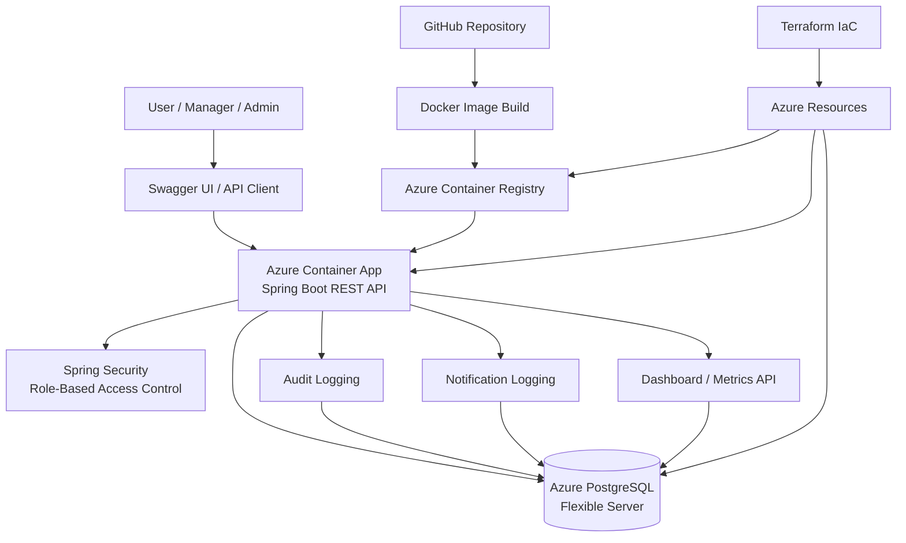
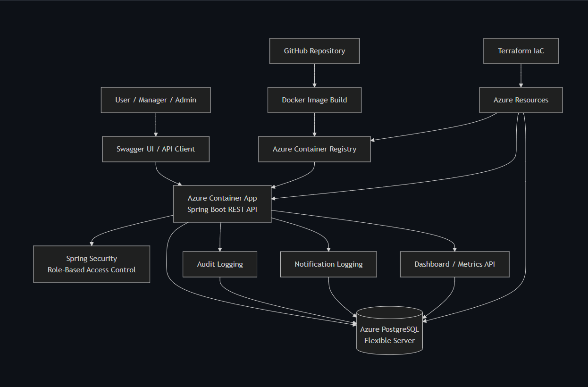
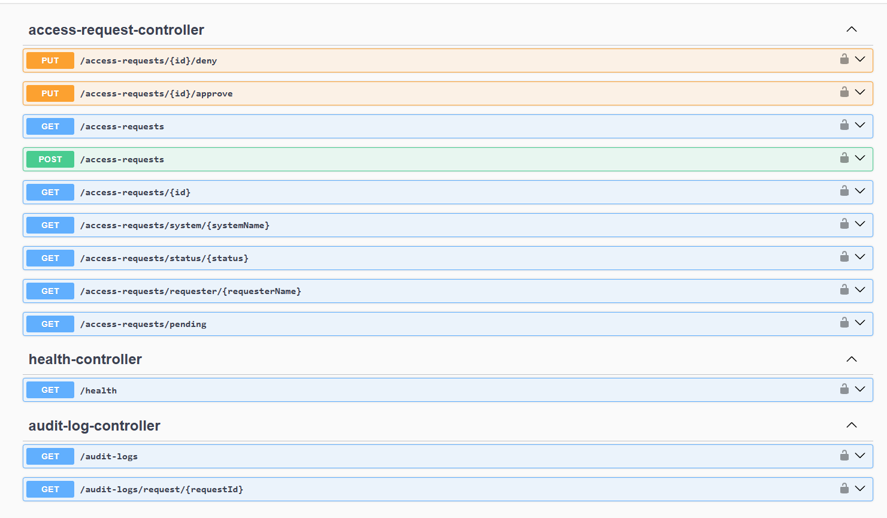
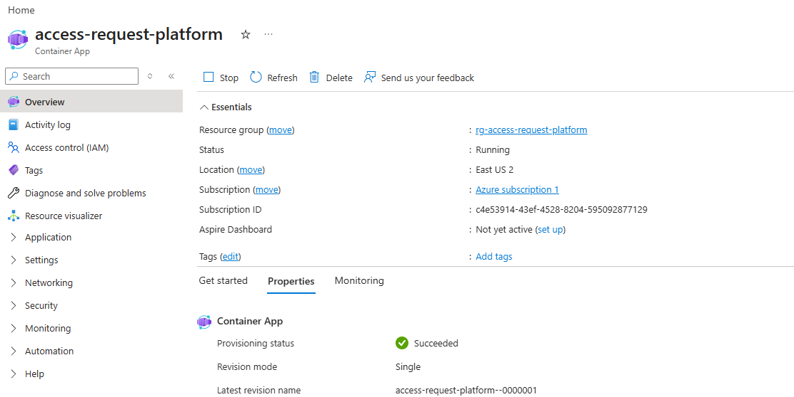
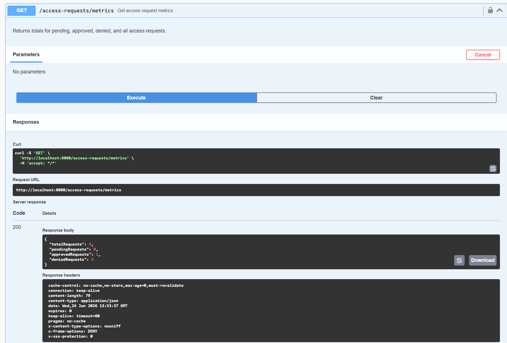
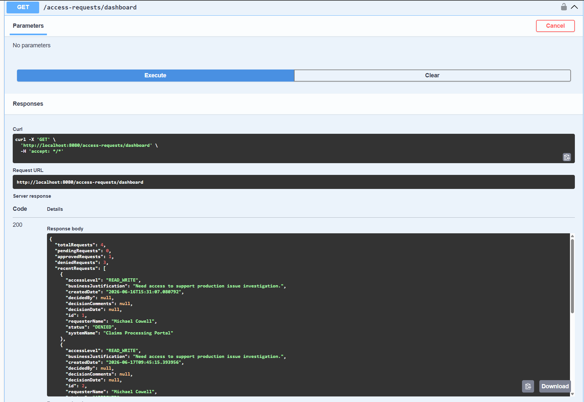
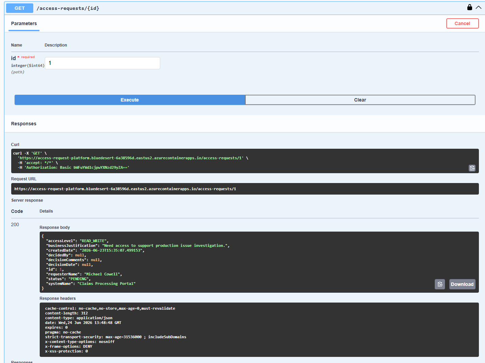

# Enterprise Access Request Platform


A cloud-native enterprise access governance platform built with Java 21, Spring Boot, PostgreSQL, Docker, Terraform, and Azure.

The application enables employees to submit access requests, managers to approve or deny those requests, and administrators to maintain complete audit and compliance visibility. The platform demonstrates enterprise software engineering practices including secure role-based authorization, workflow automation, auditing, reporting, cloud deployment, and infrastructure-as-code.

---

## Project Goals

This project was designed to showcase enterprise application development patterns commonly used within large organizations and financial institutions.

Key objectives included:

* Secure role-based access control
* Approval workflow automation
* Audit and compliance tracking
* Cloud-native deployment on Azure
* Infrastructure as Code using Terraform
* REST API design and documentation
* Automated testing and validation
* Production-style monitoring and reporting

---

## Key Features

### Access Governance

* Submit access requests
* Approval and denial workflows
* Decision comments
* Request status tracking
* Request lookup by ID
* Request filtering and search capabilities

### Security & Authorization

* Spring Security integration
* Role-based access control (Employee, Manager, Admin)
* Endpoint-level authorization
* Protected management operations
* Secure API access

### Audit & Compliance

* Complete audit logging
* Audit filtering by user
* Audit filtering by action
* Audit filtering by date range
* Request-specific audit history

### Notification Tracking

* Notification logging for request lifecycle events
* Request-specific notification history
* Extensible notification framework
* Ready for future email provider integration

### Reporting & Metrics

* Dashboard endpoint
* Request metrics endpoint
* Pending request reporting
* Approval and denial statistics
* Recent activity reporting

### API Quality

* OpenAPI / Swagger documentation
* Request validation
* Standardized exception handling
* Pagination support
* Search and filtering endpoints
* Automated test coverage

---

## Architecture



---

## Application Screenshots

### System Architecture



### Swagger API Overview



### Azure Deployment



### Dashboard & Metrics





### Access Request Workflow



---

## Technology Stack

### Backend

* Java 21
* Spring Boot
* Spring Security
* Spring Data JPA
* Maven

### Database

* PostgreSQL
* Azure PostgreSQL Flexible Server

### Cloud & Infrastructure

* Azure Container Apps
* Azure Container Registry
* Terraform
* Docker

### Testing & Documentation

* JUnit
* Mockito
* Swagger / OpenAPI

---

## Live Azure Deployment

### Health Endpoint

https://access-request-platform.bluedesert-6a38596d.eastus2.azurecontainerapps.io/health

### Swagger UI

https://access-request-platform.bluedesert-6a38596d.eastus2.azurecontainerapps.io/swagger-ui/index.html

---

## Running Locally

### Build

```bash
./mvnw clean package
```

### Run

```bash
./mvnw spring-boot:run
```

### Swagger

```text
http://localhost:8080/swagger-ui/index.html
```

---

## Docker

### Build Image

```bash
docker build -t access-request-platform .
```

### Run Container

```bash
docker run -p 8080:8080 access-request-platform
```

---

## Technical Highlights

This project demonstrates:

* Enterprise workflow automation
* Secure API development
* Cloud-native architecture
* Infrastructure as Code
* Database-driven application design
* Role-based authorization
* Audit and compliance controls
* Containerized deployment strategies
* Production-ready API documentation
* Automated testing practices

---

## Future Enhancements

* Azure Active Directory integration
* Email delivery via Azure Communication Services or SendGrid
* GitHub Actions CI/CD pipeline
* Administrative web dashboard
* Request escalation workflows
* Approval delegation
* Advanced reporting and analytics
* Multi-tenant support

---

## Author

Michael Cowell

Senior Software Engineer

Built as a portfolio project to demonstrate enterprise Java, Spring Boot, Azure, Terraform, Security, and cloud architecture skills.
