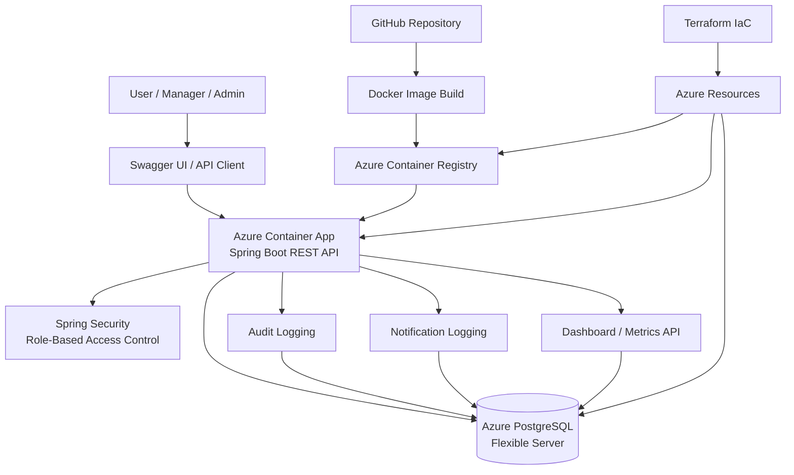

# Enterprise Access Request Platform

A cloud-native enterprise access governance application built with Java 21, Spring Boot, PostgreSQL, Docker, Terraform, and Azure.

The platform allows employees to submit access requests, managers to approve or deny those requests, and administrators to maintain a complete audit trail of all actions. The application includes role-based security, approval workflows, audit logging, notification tracking, metrics dashboards, API documentation, automated testing, and infrastructure-as-code deployment.

## Key Features

### Access Governance

* Submit access requests
* Approval and denial workflows
* Decision comments
* Request status tracking
* Request lookup by ID

### Security & Authorization

* Spring Security integration
* Role-based access control (Employee, Manager, Admin)
* Endpoint-level authorization
* Protected management functions

### Audit & Compliance

* Complete audit logging
* Audit filtering by user
* Audit filtering by action
* Audit filtering by date range
* Request-specific audit history

### Notifications

* Notification logging for request lifecycle events
* Request-specific notification history
* Framework ready for future email integration

### Reporting & Metrics

* Dashboard endpoint
* Request metrics endpoint
* Pending, approved, denied, and total request counts
* Recent activity reporting

### API Quality

* OpenAPI / Swagger documentation
* Request validation
* Standardized error responses
* Pagination support
* Search and filtering endpoints

---

## Architecture



---

## Technology Stack

### Backend

* Java 21
* Spring Boot
* Spring Security
* Spring Data JPA
* Maven

### Database

* PostgreSQL
* Azure PostgreSQL Flexible Server

### Cloud & Infrastructure

* Azure Container Apps
* Azure Container Registry
* Terraform
* Docker

### Testing & Documentation

* JUnit
* Mockito
* Swagger / OpenAPI

---

## Live Azure Deployment

### Health Endpoint

https://access-request-platform.bluedesert-6a38596d.eastus2.azurecontainerapps.io/health

### Swagger UI

https://access-request-platform.bluedesert-6a38596d.eastus2.azurecontainerapps.io/swagger-ui/index.html

---

## Running Locally

### Build

```bash
./mvnw clean package
```

### Run

```bash
./mvnw spring-boot:run
```

### Swagger

```text
http://localhost:8080/swagger-ui/index.html
```

---

## Docker

### Build Image

```bash
docker build -t access-request-platform .
```

### Run Container

```bash
docker run -p 8080:8080 access-request-platform
```

---

## Future Enhancements

* Email delivery integration (SendGrid / Azure Communication Services)
* Azure Active Directory integration
* GitHub Actions CI/CD pipeline
* Administrative dashboard UI
* Request escalation workflows
* Approval delegation
* Advanced reporting and analytics

```
```
