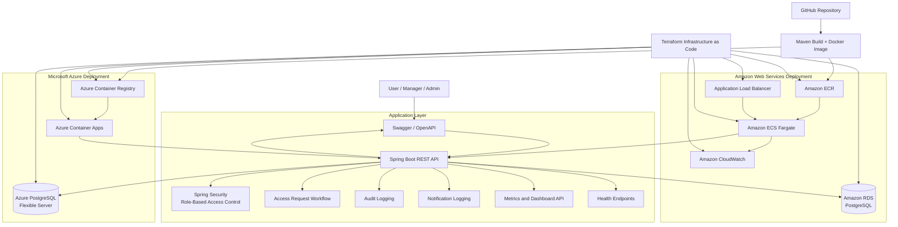
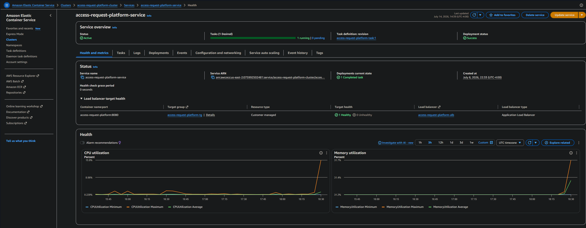
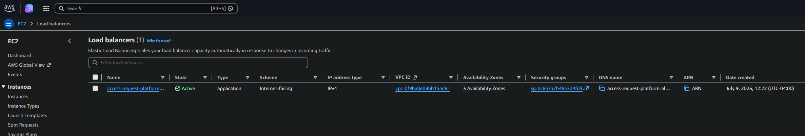
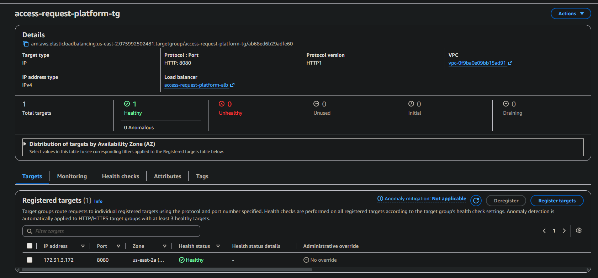
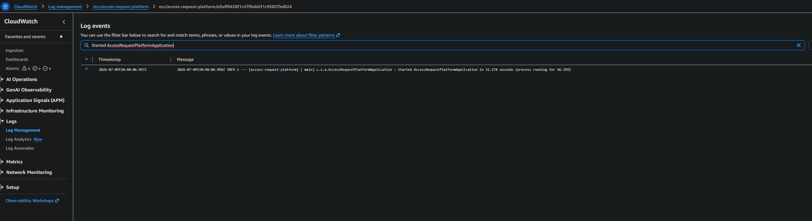
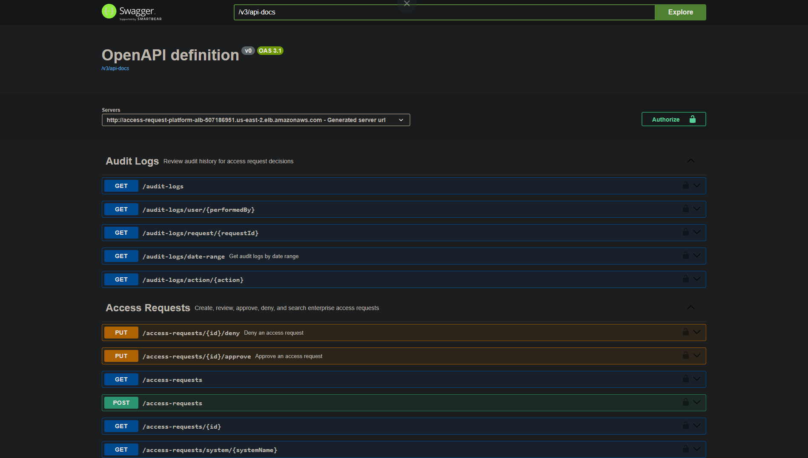
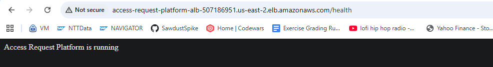
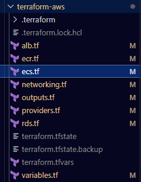

# Enterprise Access Request Platform

> Enterprise-grade Access Request Platform built with Spring Boot, secured with Spring Security, containerized with Docker, and deployed to both **Microsoft Azure** and **Amazon Web Services (AWS)**.

---

## Overview

The Enterprise Access Request Platform simulates a real-world internal application used by large organizations to manage employee access requests for business systems.

Users can submit access requests, managers review and approve or deny requests, administrators audit historical activity, and operations teams monitor system health and metrics.

The project was intentionally designed to showcase enterprise software engineering practices rather than simply implementing CRUD operations.

---

## Features

- Spring Boot REST API
- Spring Security Role-Based Access Control
- Basic Authentication
- Access Request Workflow
- Approval / Denial Process
- Audit Logging
- Metrics Dashboard API
- Health Endpoints
- OpenAPI / Swagger Documentation
- Docker Containerization
- Multi-Cloud Deployment
- Infrastructure as Code using Terraform

---

## Multi-Cloud Architecture



---

# Technology Stack

## Backend

- Java 21
- Spring Boot
- Spring Security
- Spring Data JPA
- Hibernate
- PostgreSQL
- Maven

## API

- REST
- OpenAPI 3
- Swagger UI

## DevOps

- Docker
- Terraform
- Git
- GitHub

## Cloud

### Microsoft Azure

- Azure Container Apps
- Azure Container Registry
- Azure PostgreSQL Flexible Server

### Amazon Web Services

- ECS Fargate
- Application Load Balancer
- Elastic Container Registry (ECR)
- CloudWatch
- IAM
- VPC

---

# Azure Deployment

The application was first deployed into Microsoft Azure using Azure Container Apps backed by Azure PostgreSQL.

Azure provides container hosting, managed PostgreSQL, networking, and scaling while Docker is used to package the application.

### Azure Container App


---

# AWS Deployment

The same application was later deployed into AWS using a completely different cloud architecture.

Infrastructure was provisioned using Terraform and the application was deployed as a Docker container running on ECS Fargate behind an Application Load Balancer.

### AWS Architecture

- Docker Image
- Amazon ECR
- ECS Fargate
- Application Load Balancer
- Target Groups
- CloudWatch Logs
- Terraform Infrastructure

---

### ECS Service



---

### Application Load Balancer



---

### Target Group Health



---

### CloudWatch Logging



---

# API Documentation

Swagger provides interactive documentation for every endpoint.

Features include:

- Access Requests
- Audit Logs
- Metrics
- Health Checks



---

## Sample Request

Example endpoint execution through Swagger UI.


---

## Metrics Endpoint

The application exposes metrics for operational dashboards.

Example:

- Total Requests
- Pending Requests
- Approved Requests
- Denied Requests


---

# Application Running

The deployed AWS application exposes a public health endpoint through the Application Load Balancer.



---

# Infrastructure as Code

AWS infrastructure is managed using Terraform.

Infrastructure includes:

- VPC
- ECS Cluster
- ECS Service
- ECR Repository
- Application Load Balancer
- Target Group
- IAM Resources
- Networking

Terraform allows the entire AWS environment to be recreated from source.



---

# What I Learned

Building this project provided hands-on experience with enterprise application architecture and cloud deployment across multiple providers.

Highlights include:

- Designing secure REST APIs
- Implementing role-based authorization
- Docker containerization
- Deploying to Azure Container Apps
- Deploying to AWS ECS Fargate
- Configuring Application Load Balancers
- Infrastructure as Code using Terraform
- Cloud logging and observability with CloudWatch
- Managing PostgreSQL-backed applications in cloud environments

---

# Future Enhancements

Planned improvements include:

- JWT Authentication
- OAuth2 / OpenID Connect
- CI/CD with GitHub Actions
- Redis Caching
- SQS Event Processing
- SNS Notifications
- EventBridge Integration
- Secrets Manager
- Auto Scaling Policies
- Prometheus Metrics
- Grafana Dashboards
- Kubernetes Deployment
- Unit and Integration Test Coverage

---

# Repository Structure

```
src/
terraform-aws/
docker/
docs/
README.md
```

---

# Author

Michael Cowell

Senior Software Engineer

Built as a portfolio project demonstrating enterprise Java development, cloud architecture, Infrastructure as Code, and multi-cloud deployment.